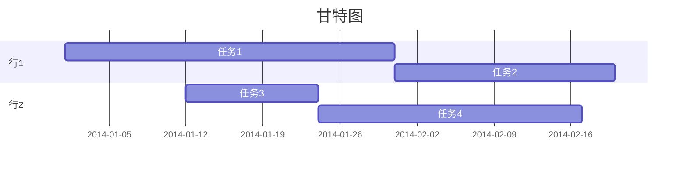
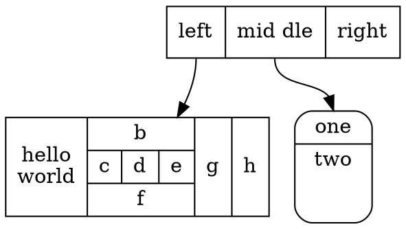
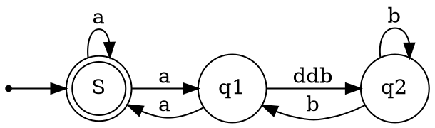

```flow
st=>start: 陪妹子进商场
op=>operation: 买买买
cond=>condition: 妹子开不开心?
e=>end: 出商场
st->op->cond
cond(yes)->e
cond(no)->op
```


```sequence
战士->领导: 首长好
Note right of 领导: 首长复杂的内心活动
领导-->战士: 同志们好
战士->>领导: 为人民服务
```



<!-- ``` mermaid
classDiagram
Class01 <|-- AveryLongClass : Cool
Class03 *-- Class04
Class05 o-- Class06
Class07 .. Class08
Class09 --> C2 : Where am i?
Class09 --* C3
Class09 --|> Class07
Class07 : equals()
Class07 : Object[] elementData
Class01 : size()
Class01 : int chimp
Class01 : int gorilla
Class08 <--> C2: Cool label
<!-- ``` --> -->




