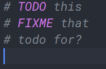
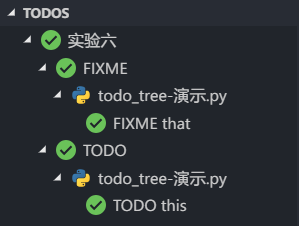
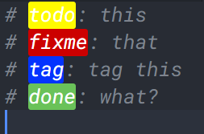
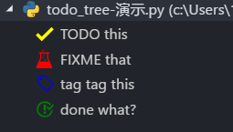

## 引言

一开始,我只是想找一个能够跳转,或者标记行的插件,让我在比较长的代码中找到想要的东西,,,在试过bookmark,todo hightlight ,等类似的东西后,发现这东西(`todo-tree`)是真的神奇,非常适合我啊.必须要推过一波.

另外还个叫`Color Highlight`的插件,用于显示rgb,hex等表示的颜色,挺方便的,对于其他插件的对我非css文件"友好"


## 介绍

首先来,介绍下它的基本功能把.

首先,是一个高亮的功能,初始的话,只支持TODO,和FIXME两个标记



其次是资源管理器侧边栏上的一个小栏目,通过点击对象,可以跳转到对应的位置.



但是,这款插件可以配置的地方非常关键,它可以配置需要高亮的标签名,可以配置标签的高亮方式,图标,还可以配置滚动条上显示的色块.标签排列方式等等.

先看下我配置出的效果.





使用感觉瞬间就提升了.其他的todo hightlight或者是bookmarks简直弱爆了啊...


顺便贴下我的配置,有兴趣可以根据其介绍页面自己配置下.

```json
"todo-tree.regex.regex": "((//|#|<!--|;|/\\*|^)\\s*($TAGS):|^\\s*- \\[ \\])",
    "todo-tree.general.tags": [
        "TODO",
        "FIXME",
        "tag",
        "done",
        "note"
    ],
    "todo-tree.regex.regexCaseSensitive": false,
    "todo-tree.tree.showInExplorer": true,
    "todo-tree.highlights.defaultHighlight": {
        "foreground": "white",
        "background": "yellow",
        "icon": "check",
        "rulerColour": "yellow",
        "type": "tag",
        "iconColour": "yellow"
    },
    "todo-tree.highlights.customHighlight": {
        "todo": {
            "background": "yellow",
            "rulerColour": "yellow",
            "iconColour": "yellow"
        },
        "FIXME": {
            "background": "red",
            "icon": "beaker",
            "rulerColour": "red",
            "iconColour": "red",
        },
        "tag": {
            "background": "blue",
            "icon": "tag",
            "rulerColour": "blue",
            "iconColour": "blue",
            "rulerLane": "full"
        },
        "done": {
            "background": "green",
            "icon": "issue-closed",
            "rulerColour": "green",
            "iconColour": "green",
        },
        "note": {
            "background": "#f90",
            "icon": "note",
            "rulerColour": "#f90",
            "iconColour ": "#f90"
        }
    },
```


<https://marketplace.visualstudio.com/items?itemName=Gruntfuggly.todo-tree#review-details>


<https://github.com/Gruntfuggly/todo-tree>


# 更新

2019/9/21 todo-tree 貌似大更新了次.更改了设置接口,还好没改多少.已经修改成新的了.详情看插件介绍页面.


