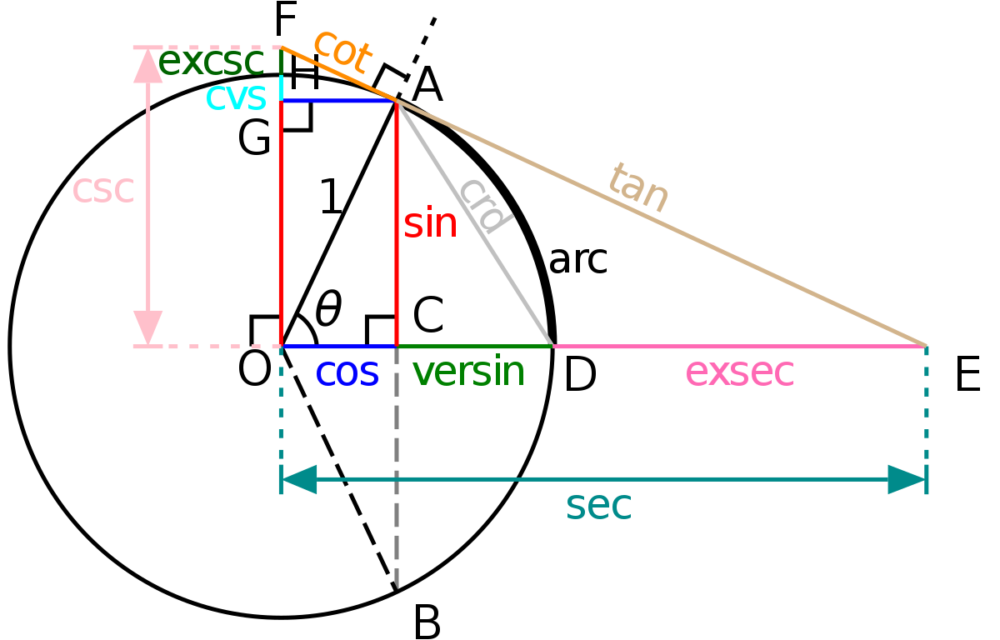
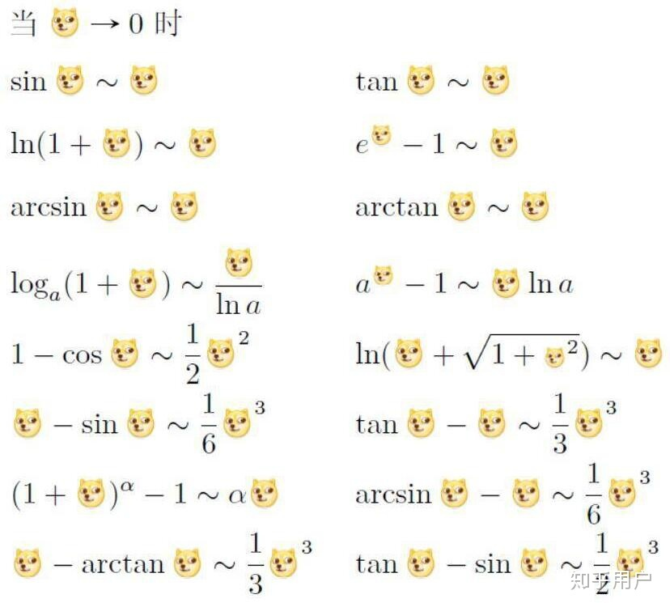

### 泰勒公式

$f(x+\Delta{x}) - f(x) = \frac{f'(x)}{1!}\Delta{x} +\frac{f''(x)}{2!}\Delta{x^2}+...+\frac{f^{(n)}(x)}{n!}\Delta{x^n} + o(\Delta{x^n})$

### 可导

左右极限存在相等($x^-,x,x^+$)

$f'(x) = \lim_{\Delta x \to 0}{\frac{\Delta y}{\Delta x}}$

### 任意的 $\epsilon$ 可取值带入.

...

### 可微?

$\Delta y = A\Delta x + o(\Delta x)$

### 公式

$x^3-1 = (x-1)(x^2+x+1)$

### 连续

$\lim_{x \to x_0}f(x) = f(x_0)$

f(x) 为函数,f(x_0) 为一确定值,两者却有不同.

delta x -> 0 时,delta y -> 0

### 唯一的可能...

### 准确推理

### 见根号差,有理化

### 反函数求导公式

$\frac{d^2x}{dy^2} = \frac{-f''(x)}{f'(x)^3}$

$e^{2x\ln x} = x^{2x}$

$e^{f(x)}-1 \sim f(x),f(x)\to 0$

$\lim_{x \to 0}{\frac{f'(x)-f'(0)}{x-0}} = \lim_{x \to 0}{f''(x)} = f''(0);连续性$

驻点:一阶导数为0

拐点:凹凸弧分界点

### 无中生有,一分为二

0 = 1-1

1 = 2*(1/2)

### 极限,趋于零是特殊的;一般会直接得到数字

### 变量的传递,x与f(x)等同为变量,地位相同

### 主要矛盾,约束,稳定点

### 拉格朗日中值定理

$f(b) - f(a) = f'(\xi)(b-a);a<\xi<b$

$f(x) = f'(\xi)x;0<\xi<x$

### 极值

一二阶导数,零点

函数图形

### 斜渐进线

$\lim_{x \to \infty}\frac{f(x)}{x} = k_1,\lim_{x \to \infty}[f(x) - k_1 x] = b_1;则y = k_1x+b_1是其斜渐进线$

### 驻点

可导函数f(x)的极值点必定是它的驻点，但反过来，函数的驻点却不一定是极值点。 

1.极值点不一定是驻点。如y=|x|，在x=0点处不可导，故不是驻点，但,是极(小)值点。
2.驻点也不一定是极值点。如y=x³，在x=0处导数为0，是驻点，但没有极值，故不是极值点

### 可疑点

## 第五讲中值定理

区间;区间;

夹逼;夹逼;

1. 利用连续导数在闭区间的介值定理可解决的一类中值问题,即证明存在$\xi \in [a,b]$使得某个命题成立
2. 利用罗尔定理,费马定理可解决一类中值问题,即证明存在$\xi \in (a,b),H(\xi,f(\xi),f'(\xi)) = 0$(辅助函数)
3. 拉格朗日;双中值且中值不同(分点的选取)
4. 拉格朗,柯西;双中值,不要求不同.(对哪两个函数.)
5. 泰勒公式;高阶导数(导数信息最多的.)

有界,介值,零点.

费马;极值点导数为零,说明可导函数的最值在区间内取到;

罗尔;两侧相等

拉格朗;过渡导数,整体导数

柯西;抽象拉格朗

泰勒;极小值?导数函数近似代替函数

麦克劳林公式:x0为0的泰勒公式

佩亚诺余项:差值设为前一个的高阶无穷小

介值定理:介于最大值与最小值之间...的值

函数中值定理,导数(微分)中值定理,,存在...

f(b)-f(a) = f('xi)(b-a);积分...关联;important;:star:

### 泰勒公式

设f(x) 在点x_0的某个邻域内n+1阶导数存在,则对该邻域内的任意点x,有

$f(x) = f(x_0) + f'(x_0)(x-x_0)+...+\frac{f^{(n)}(x-x_0)^n}{(n)!}+\frac{f^{(n+1)}(\xi)}{(n+1)!}(x-x_0)^{n+1};\xi \in (x,x_0)$

$\begin{equation}
\left\{
             \begin{array}{lr}
             x=\frac{3\pi}{2}(1+2t)\cos(\dfrac{3\pi}{2}(1+2t)), &  \\
             y=s, & 0\leq s\leq L,|t|\leq1.\\
             z=\frac{3\pi}{2}(1+2t)\sin(\dfrac{3\pi}{2}(1+2t)), &  
             \end{array}
\right.
\end{equation}
$

$y = 
 \begin{cases}
             x=\frac{3\pi}{2}(1+2t)\cos(\dfrac{3\pi}{2}(1+2t)), &  \\
             y=s, & 0\leq s\leq L,|t|\leq1.\\
             z=\frac{3\pi}{2}(1+2t)\sin(\dfrac{3\pi}{2}(1+2t)), &  
\end{cases}
$

### 存在

### 工作台,辅助视角

### 函数导数存在不一定也连续

f'(x)存在,但$\lim_{x \to x_0}{f'(x)}$(连续性)不一定存在

例如 $f(x) = x^2\sin{\frac{1}{x}}, x\neq 0;f(x) = 0;x =0$

### 洛必达定理的条件

第三个,要求的是连续性的判别,及非震荡等间断点

因为洛必达的存在,极限的正负,基本还是只有局部保号性.具体的点,可能为0...

$\sqrt{x+1} - \sqrt{x} = \frac{1}{2\sqrt{x+\theta(x)}};0<\theta(x)<1$

### 反证法

 

F(x) = f(x)g'(x)-g(x)f'(x)

## 第六讲 零点问题,微分不等式

### 零点问题

1. 零点定理(根的存在性)

2. 单调性(根的唯一性)

3. 罗尔原话(罗尔定理的推论)(至少有多少根)

    $若f^{(n)}(x) = 0至多有k个根,则在f(x) = 0至多有k+n个根$

    

### 微分不等式

1. $设a,b为实数,则$

    1. $2|ab|\leq a^2+b^2;$
    2. $|a \pm b| \leq |a| + |b|;$
    3. $||a|-|b|| \leq |a-b|$

2. $设 a_1,a_2,a_3...,a_n > 0,则$

    1. $\frac{a_1+a_2+a_3+...+a_n}{n} \geq \sqrt[n]{a_1 a_2 ... a_n}(当且仅当a_1=a_2= ...=a_n时等号成立)$(算术平均数大于几何平均数)
    2. $|\frac{a_1+a_2+a_3+...+a_n}{n}| \leq \sqrt{\frac{a_1^2+a_2^2+a_3^2+...+a_n^2}{n}};(当且仅当a_1=a_2= ...=a_n时等号成立)$

3. 设$x>0,y>0,p>0,q>0,\frac{1}{p}+\frac{1}{q} =1 则 xy \leq \frac{x^p}{p}+\frac{y^q}{q}$

4. $(a^2+b^2)(c^2+d^2) \geq (ac+bd)^2$

5. 若f(x),g(x)在[a,b]上可积且平方可积,则

    $[\int_a^bf(x)*g(x)dx]^2 \leq \int_a^bf(x)^2dx*\int_a^bg(x)^2dx $

6. 设f(x)在[a,b]上p次方可积,g(x)在[a,b]上q次方可积,则

    $|\int_a^b{f(x)*g(x)dx}| \leq [ \int_a^b{|f(x)|^pdx}]^{\frac{1}{p}}*[ \int_a^b{|g(x)|^q dx}]^{\frac{1}{q}};$

    $其中p>1,\frac{1}{p}+\frac{1}{q} = 1$

7. 其他重要不等式

    1. 设a>b>0,则$\begin{cases}当n>0时,a^n>b^n \\ 当n<0 时,a^n<b^n\end{cases}$
    2. 若0<a<x<b,0<c<y<d,则$\frac{c}{b} < \frac{y}{x} < \frac{d}{a}$

调和平均数:

$H = \frac{n}{\frac{1}{x_1}+\frac{1}{x_2}+...+\frac{1}{x_n}}$

平方平均数: 一组数据的平方的平均数的算术平方根

平方>=算术>=几何>=调和

复合,自然对数,分数,,,强导...

导数,,,中值定理(拉格朗日)...常数变量化....

$f[\lambda x_1 + (1-\lambda )x_2] < \lambda f(x_1) + (1-\lambda) f(x_2)$

泰勒,拉格朗,消元

 

### 第七讲 一元微积分的概念与计算

不可导的证明要涉及左右导数...还是可导性的证明都要..

原函数存在:函数连续(不能有一类,无穷间断点)

定积分存在:函数有界

$y = 2Xsin(\frac{1}{x^2})-\frac{2}{x}cos(\frac{1}{x^2})$

#### 界定变量..分辨变量

#### 数学语言

$\int_a^bf(x)dx \ge \int_{x_0-\xi}^{x_0+\xi}f(x)dx \ge 0$

开拓

一步步

分部积分:$\int udv = uv - \int vdu$

定积分注意求uv的范围积分.

移项整理,积分加减分开.

平方加减,三角函数.

倍角公式,降维

分母分解式.

函数的奇偶性,几何性.

区间再现公式???三角函数pi

$\int_a^bf(x)dx = \int_a^bf(a+b-x)dx$

$\int_0^{\pi}xsin^9x dx = \int_0^{\pi}\pi\sin^9t dt - \int_0^{\pi}tsin^9t dt$

xf(x) 型函数.转化求解.

华里士(Wallis)公式:

对于$\int_0^{\frac{\pi}{2}}sin^nxdx;n=(0,1,2,...)$

$\frac{n-1}{n}*\frac{n-3}{n-2}...*1;n为大于1的奇数$

$\frac{n-1}{n}*\frac{n-3}{n-2}...*\frac{\pi}{2};n为正偶数$

多次变形....

草稿标号.

#### 数形结合!

整个函数范围内的变量在,函数内函数中算是常量(定积分)(变限积分)??????

#### 变限积分的求导公式

$F'(x) = f[v1(x)]v1'(x) - f[v2(x)]v2'(x)$

真的就只用v1'(x)就行了..f[v1(x)]的形式是多样的.

$F(x) = \int_{v1(x)}^{v2(x)}f(t)dt$

4-1=3,1到4走三步

简化变量构成:

$x-x^2 = \frac{1}{4} - (x-\frac{1}{2})^2$

### 常用公式整理

#### 三角函数导数

$(\arctan{\xi})' = \frac{1}{1+\xi^2}$

$(\arcsin{\xi})' = \frac{1}{\sqrt{1-\xi^2}}$

$(\tan{\xi})' = sec^2\xi = \frac{1}{cos^2\xi}$

$(\sec{x})' = \sec{x} \tan{x}$

$(\frac{-1}{1+x})' = \frac{1}{(1+x)^2}$

$(\frac{-1}{1+e^x})' = \frac{e^x}{(1+e^x)^2}$

$1-x^2;x = sin/cos;x=secx/cscx;....$

$(sinx)' = cosx$

等价无穷小是近似的方法

各种尝试,各种,,,

固定又怎样,夹逼定理..(固定简化,夹逼求解)

有理函数的积分.

### 积分表及推导,,加入背诵...

### 了解函数性质...

### 两个重要极限

$\lim_{x \to 0}\frac{\sin x}{x} = 1$

$\lim_{x \to \infty}{(1+\frac{1}{x})^x} = e$

不定积分的积分方法

1. 凑微分法(变限)
2. 换元法
3. 分部积分
4. 有理函数积分

## 第八讲:一元函数微分学的几何应用

#### 计算平面图形面积

1. 曲线y = y1(x)与y=y2(x)及x=a,x=b(a<b)所围成的平面图形的面积

    $S = \int_a^b|y_1(x)-y_2(x)|dx$

2. 曲线r = r1(t)与r = r2(t)与两射线t=a,t=b(0<b-a<=2pi)所围成的曲边扇形面积

    $S = \frac{1}{2}\int_a^b|r_1^2(t)-r_2^2(t)|dt$

#### 计算旋转体体积

1. 曲线y=y(x)与x=a,x=b(a<b)及x轴围成的曲边梯形绕x轴一周所得到的旋转体的体积
    1. $V = \pi \int_a^b y^2(x)dx$
2. 曲线y=y1(x)>=0,y=y2(x)>=0与x=a,x=b(a<b)及x轴围成的曲边题型绕x轴一周所得到的旋转体的体积
    1. $V = \pi \int_a^b |y_1^2(x)-y_2^2(x)| dx$
3. 曲线y=y(x)与x=a,x=b(0<=a<b)及x轴围成的曲边梯形绕y轴一周所得到的旋转体的体积
    1. $V = 2\pi \int_a^b x |y(x)| dx$
4. 曲线y=y1(x),y=y2(x)与x=a,x=b(0<=a<b)及x轴围成的曲边梯形绕y轴一周所得到的旋转体的体积
    1. $V = 2 \pi \int_a^b x|y_1(x)-y_2(x)| dx$

#### 交换积分区间

二重积分就是加了个密度函数之类的概念....

后面的积分区间就是原先的积分函数之类的,,

画图,,切线,交换即可.

### 第九讲 积分等式与积分不等式

$\frac{\int_a^bf(x)g(x)dx - 0}{\int_a^bg(x)dx-0} = \frac{f(\xi)g(\xi)}{g(\xi)};\xi \in [a,b]$

#### 二,不等式问题

1. 用函数单调性
    1. "限变量化构造辅助函数,由辅助函数的单调性来证明不等式"
    2. 多用于给定条件为 f(x) 在 [a,b] 上连续 的情形
2. 利用拉格朗日中值定理
    1. 两个值
3. 利用泰勒公式
    1. 一个值?
4. 化简再证明?
    1. 换元,凑微分,分部

向前走,向后看...推倒;

无法即刻推到,都是需要坚实的计算到达的巧合.

辅助公式,,,函数性质...

ln降级;等价...;

等价无穷小在乘除法的范围内.

无穷小

xlnx-x+c

$f_x'(0,y) = \lim_{x \to 0}\frac{f(x,y)-f(0,y)}{x-0}$

隐函数存在定理,,,

对一个等式的求导...

F(x,y)=0

### 第十讲 多元函数微分学

高阶偏导求解...

极值问题.

### 第十一讲 二重积分

例7.25,7.26;二重积分的精确定义

可积函数必有界

积分区域可加

积分保号

积分估值定理(最大最小值乘面积之内)

积分中值定理,(可以找到平均?高?)

对称性与轮换对称性(交换变量,区间不变(关于y=x对称)(和整))

#### 二重积分的计算

二重积分范围与积面积相同.积的是三维的高.

##### 单位圆

角度遍历,积线

长度遍历,积弧...

对等长的弧积...

15-14=1

二重积分的中值定理,,在两侧区间确定?有关系时,是个方便的东西呢.

移,变量化,辅助函数,证明函数性质.

积分求导中的,积分变量,与,积分变量的函数要对应

乘,加,补全.

常用等价无穷小

基本上都是除以x的k次方求极限,x -> 0,极限等于1?,等价无穷小的定义.

$\int_a^bf(x)dx = \int_x^yy(t)x'(t)dt$

$cos^2x = \frac{1+cos2x}{2}$

 

### 第十二讲 常微分方程

含有未知函数及其导数的方程称为微分方程

* 一阶微分方程的求解

    * 变量可分离型

        * dx,dy分离积分求解
* 可化为变量可分离型
  
    * 变量代换;u = ax+b+c
        * 齐次微分方程;u = y/x;:star:
    * 一阶线性微分方程
* y'+p(x)y = q(x)
        * 辅助函数,$e^{\int p(x)dx}$
* 伯努力方程
        * P(x)y^n

* 二阶可降阶微分方程的求解

    * y'' = f(x,y')型    方程中不显含未知函数y

        变为一阶???

    * y''= f(y,y')型    方程中不显含自变量x

        变为一阶即可

* 高阶线性微分方程的求解

    * 二阶线性微分方程的概念

        变系数与常系数

        齐次(=0)

        与非齐次

    * 线性微分方程的解的结构

        * 若y1(x)是等于f1(x)的二阶线性微分方程的通解,y2(x)是等于f2(x)的
        * 二阶线性微分方程的通解,
        * 则y1(x) +y2(x) 是等于f1(x)+f2(x)的微分方程的通解 

        线性无关解

        y(x) = C1y1(x)+C2y2(x)    通解

        特解加通解是特解

        

        两个特解相加是右边系数相加(运算)的方程的解?

    * 二阶常系数 **齐次** 线性微分方程的 **通解** :star:

        * 对应的特征方程,求特征根;导数阶与次方阶等价转化
    * 非重根对应一项$Ce^{\lambda  x}$
        
        * 二重根对应$y = (C_1+C_2 x)e^{\lambda x}$
    * 共轭复根($\alpha \pm \beta i$)对应 $y = e^{ax}(C_1cos\beta x+ C_2 sin \beta x)$
        
    *  通解 与 特解
        
    * 二阶常系数 **非齐次** 线性方程的**特解** :star:
    
        * 首先看看有没有特殊值求特解
    * 对于y''+p y'+ q y = f(x)
        * 当自由项$f(x) = P_n(x)e^{\lambda x}$时特解要设为$y^* = e^{\lambda x}Q_n(x)x^k$
        * $e^{\lambda x}$ 照抄
            * k 是特征方程 含 根 $\lambda$ 的重复次数
            * Q 与 P 同次 多项式
        * 当自由项$f(x) = e^{ax}[P_m(x)cos\beta x + Pn(x)sin\beta x]$时
        * 特解要设为$y^* = e^{ax}[Q_l^{(1)}(x)cos\beta x + Q_l^{(2)}(x)sin\beta x]x^k$
            * k 特征方程含 $\alpha + i \beta$ 的重复次数
    
    * n解常系数齐次线性方程的解
    
    * n阶非齐次微分方程的解

直接带入求得关系???

整体作为e的指数,,,加法是指数上的加法

伯努利,,换位???

#### 重要积分

$\int\ln x dx = x \ln x - x +C$

$\int\sec t dt = \ln|sect+tant|+C$

$\int\frac{dx}{\sqrt{x^2+a^2}} = \ln(x+\sqrt{x^2+a^2})+C$;x=a tant

$\int\frac{dx}{x^2+a^2} = \frac{1}{a}arctan\frac{x}{a}+C$

$\int\frac{dx}{x^2-a^2} = \frac{1}{2a}\ln{|\frac{x-a}{x+a}|}+C$;有理函数的积分

$\int arctan\frac{x}{a}dx = x arctan\frac{x}{a} - \frac{a}{2}ln(a^2+x^2)+C$;分部积分

$\int e^{ax} sinbxdx = \frac{1}{a^2+b^2}e^{ax}(asinbx-bcosbx)+C$;n*I = ?

任一原函数可以表示为

$F(x) = \int_0^xf(t)dt +C ,且F'(x) = f(x)$

$\frac{dy}{dx} = \frac{dy}{dt}*\frac{dt}{dx}$

$\frac{d^2y}{dx^2} = \frac{d(\frac{dy}{dx})}{dt}*\frac{dt}{dx}$

csc;cot;co

条件极值..

最好不要特殊换元 t = e^x

计算量太大?

### 第十四讲 数二专题内容

曲率公式:

$k = \frac{|y''|}{[1+(y')^2]^{\frac{3}{2}}}$

曲率半径:

$R= \frac{1}{k}$

曲率圆表达式:

$(X-\alpha)^2+(Y-\beta)^2 = R^2$

$\alpha = x - \frac{y'[1+(y')^2]}{y''},\beta = y+\frac{1+(y')^2}{y''}$

### 第二讲 极限于连续

若数列收敛,则其任意子序列也收敛且收敛极限相同.

夹逼,左右极限

#### 收敛数列的性质

唯一(收敛)

有界(收敛)

保号(趋向)

若每个数列极限存在,组合一般也存在.

算术平均数构成,,乘积,指数.

#### 函数极限存在的充要条件

左右极限存在且相等

函数等于 常数加无穷小

#### 无穷小运算规则

1. 有限个无穷小的和是无穷小
2. 有界函数与无穷小的乘积是无穷小
3. 有限个无穷小的乘积是无穷小

海涅定理

x->x0;xn->x0;

欧拉公式:

$e^{i\theta} = cos\theta + i sin\theta$

## 线性代数

伴随矩阵: 余子式,转置

#### 斯密特斯正交化

根据前面的结果,求ai 分量 的独立量?

$|\lambda E - A| = 0 求\lambda 的值;确定对应的向量 r(\lambda_i E - A) = n - n_i,\lambda_i为n_i重特征值$

相似对角化,,特征值对角矩阵,其余元素都为0